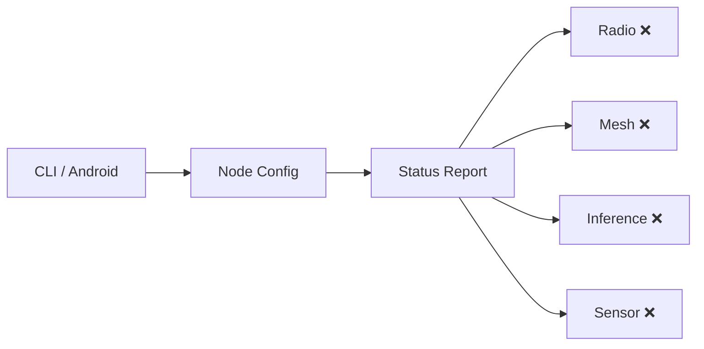
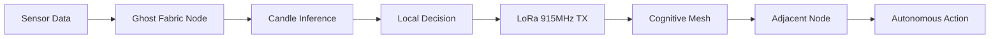

<!-- Unlicense — cochranblock.org -->

# Proof of Artifacts

*Visual and structural evidence that this project works, ships, and is real.*

> Edge intelligence scaffold with CLI, node identity, and federal compliance documentation.

## Architecture



*❌ = stub — not yet implemented. See WHITEPAPER.md for target architecture.*

### Target Architecture (not yet built)



## Build Output

| Metric | Value |
|--------|-------|
| Binary size (release, stripped) | 469,792 bytes (459KB) |
| Binary size (pre-deps scaffold) | 285,936 bytes (279KB) |
| Target binary size (with weights) | 19MB (statically linked, embedded weights) |
| Runtime | Bare metal Rust — no interpreter, no GC |
| Radio band | 915MHz ISM/LoRa |
| Throughput | ~5.5 kbps (SF7/125kHz) |
| Cold-start target | <50ms |
| RAM target | 8–32MB |
| Python dependencies | Zero in production |
| Cloud dependencies | Zero |

## Codebase Stats

| Metric | Value |
|--------|-------|
| Rust LOC (src/) | 235 |
| Source files | 7 (main.rs, lib.rs, config.rs, radio.rs, mesh.rs, inference.rs, sensor.rs) |
| Public functions (P13 tokenized) | 12 (f0–f11) |
| Types (P13 tokenized) | 1 (T0=NodeConfig) |
| Fields (P13 tokenized) | 4 (s0–s3) |
| CLI commands | 3 (init, start, status) |
| Direct dependencies | 5 (clap, dirs, rand, serde, serde_json) |
| Transitive dependencies | ~45 |
| `unsafe` blocks (core) | 0 |
| `unsafe` blocks (android) | 1 (set_var for HOME path) |

## QA Results

### QA Round 1 (2026-03-27)

| Check | Result |
|-------|--------|
| `cargo build --release` | PASS — zero errors |
| `cargo clippy --release -- -D warnings` | PASS — zero warnings |
| `cargo test` | PASS — 0 tests (none written) |
| P12 slop scan | PASS — "utilizing" fixed to "using" |
| Git status | PASS — clean |

### QA Round 2 (2026-03-27)

| Check | Result |
|-------|--------|
| `cargo clean && cargo build --release` | PASS — fresh compile, zero errors |
| `cargo clippy --release -- -D warnings` | PASS — zero warnings |
| Cargo.lock committed | PASS — tracked for reproducibility |
| Binary runs | PASS — prints version |

### Post-Feature QA (2026-03-29)

| Check | Result |
|-------|--------|
| `cargo build --release` | PASS — zero errors |
| `cargo clippy --release -- -D warnings` | PASS — zero warnings |
| `ghost-fabric --help` | PASS — shows subcommands |
| `ghost-fabric init` | PASS — generates node ID |
| `ghost-fabric status` | PASS — displays config |
| `ghost-fabric start` | PASS — reports subsystem status |

## P13 Tokenization Stats

| Category | Count | Range |
|----------|-------|-------|
| Functions | 12 | f0–f11 |
| Types | 1 | T0 |
| Fields | 4 | s0–s3 |
| CLI commands | 3 | c0–c2 |
| Error variants | 0 | — |

Compression map: [docs/compression_map.md](docs/compression_map.md)

## Federal Compliance

11 documents in [`govdocs/`](govdocs/):

| Document | Framework |
|----------|-----------|
| SBOM.md | EO 14028 |
| SSDF.md | NIST SP 800-218 |
| SUPPLY_CHAIN.md | Supply chain integrity |
| SECURITY.md | Security posture |
| ACCESSIBILITY.md | Section 508 |
| PRIVACY.md | Privacy impact |
| FIPS.md | FIPS 140-2/3 |
| FedRAMP_NOTES.md | FedRAMP |
| CMMC.md | CMMC L1-L2 |
| ITAR_EAR.md | Export control |
| FEDERAL_USE_CASES.md | Agency use cases |

## How to Verify

```bash
cargo build --release
./target/release/ghost-fabric init
./target/release/ghost-fabric status
./target/release/ghost-fabric start
./target/release/ghost-fabric --help
```

## Whitepaper

See [WHITEPAPER.md](WHITEPAPER.md) for the full technical argument.

---

*Part of the [CochranBlock](https://cochranblock.org) zero-cloud architecture. All source under the Unlicense.*
