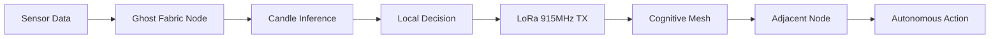

<!-- Unlicense — cochranblock.org -->

# Proof of Artifacts

*Visual and structural evidence that this project works, ships, and is real.*

> This is not a demo repo. This is a whitepaper and scaffold for a sovereign edge intelligence system.

## Architecture



## Build Output

| Metric | Value |
|--------|-------|
| Target binary size | 19MB (statically linked, embedded weights) |
| Runtime | Bare metal Rust — no interpreter, no GC |
| Radio band | 915MHz ISM/LoRa |
| Throughput | ~5.5 kbps (SF7/125kHz) |
| Cold-start target | <50ms |
| RAM target | 8–32MB |
| Python dependencies | Zero in production |
| Cloud dependencies | Zero |

## How to Verify

```bash
# This is currently a whitepaper + scaffold. Build:
cargo build --release
```

## Whitepaper

See [WHITEPAPER.md](WHITEPAPER.md) for the full technical argument.

---

*Part of the [CochranBlock](https://cochranblock.org) zero-cloud architecture. All source under the Unlicense.*
