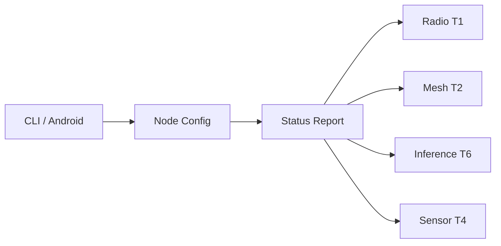
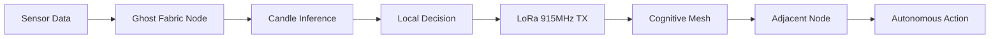

<!-- Unlicense — cochranblock.org -->

# Proof of Artifacts

*Visual and structural evidence that this project works, ships, and is real.*

> Edge intelligence scaffold with CLI, node identity, subsystem traits, HMAC-authenticated mesh frames, 118 tests, and federal compliance documentation.

## Architecture



*Subsystem traits defined with mock implementations and tests. Hardware drivers not yet implemented. See WHITEPAPER.md for target architecture.*

### Target Architecture (not yet built)



## Build Output

| Metric | Value |
|--------|-------|
| Binary size (release, stripped) | 470,080 bytes (459KB) |
| Binary size (pre-deps scaffold) | 285,936 bytes (279KB) |
| Target binary size (with weights) | 19MB (statically linked, embedded weights) |
| Runtime | Bare metal Rust — no interpreter, no GC |
| Radio band | 915MHz ISM/LoRa |
| Throughput | ~5.5 kbps (SF7/125kHz) |
| Cold-start target | <50ms |
| RAM target | 8–32MB |
| Python dependencies | Zero in production |
| Cloud dependencies | Zero |
| Android AAB (arm64-v8a) | 1,643,180 bytes (1.6MB) |
| Android .so (arm64-v8a) | 3,062,432 bytes (3MB) |

## Codebase Stats

| Metric | Value |
|--------|-------|
| Rust LOC (src/) | 1,101 |
| Source files | 10 (main.rs, lib.rs, config.rs, lifecycle.rs, radio.rs, mesh.rs, inference.rs, sensor.rs, packet.rs, uds_radio.rs) |
| Public functions (P13 tokenized) | 26 (f0–f26) |
| Types (P13 tokenized) | 16 (T0–T16 including traits + mocks) |
| Fields (P13 tokenized) | 5 (s0–s4 including peers) |
| CLI commands | 3 (init, start, status) |
| Unit tests | 103 (config 29, radio 22, packet 19, mesh 17, uds_radio 6, inference 6, sensor 4) |
| Integration tests | 15 |
| Direct dependencies | 9 (clap, dirs, libc, rand, serde, serde_json, hmac, sha2, hkdf) |
| Transitive dependencies | ~49 |
| `unsafe` blocks (core) | 6 (lifecycle.rs: 4 libc::kill, main.rs: 2 SIGINT handler) |
| `unsafe` blocks (android) | 1 (set_var for HOME path) |

## Subsystem Implementation

| Subsystem | Trait | Mock | Tests | Status |
|-----------|-------|------|-------|--------|
| Radio | T1 (RadioDriver) | T8 (MockRadio), T15 (UdsRadio) | 22 | Trait + UDS multi-process driver |
| Mesh | T2 (MeshNetwork) | T9 (PeerTable) | 17 | Route scoring + state sync (f23/f24/f25) |
| Sensor | T4 (SensorDriver) | T10 (MockSensor) | 4 | Trait defined, no GPIO/I2C/SPI driver |
| Inference | T6 (InferenceEngine) | T11 (MockEngine) | 6 | Trait defined, no Candle integration |
| Packet | T12/T13/T14/T16 | — | 19 | CBOR frames + HMAC-SHA256 auth (f18/f19/f26) |
| Config | T0 | — | 29 | Validation, LoRa spec, network_secret |
| UDS Radio | T15 (UdsRadio) | — | 6 | Unix domain socket driver for multi-process mesh |
| Integration | — | — | 15 | End-to-end pipeline + auth + sync |
| **Total** | — | — | **118** | All tests passing |

## Packet Authentication

Every T12 mesh frame is HMAC-SHA256 authenticated. Wire format: `[CBOR bytes][16-byte truncated MAC]`.

| Property | Value |
|----------|-------|
| Algorithm | HMAC-SHA256, truncated to 128 bits |
| Key derivation | HKDF-SHA256 from `network_secret` config field |
| HKDF info | `b"ghost-fabric mesh v1"` |
| MAC size | 16 bytes (128 bits) — appended after CBOR |
| Max CBOR payload | 235 bytes (251 total - 16 MAC) |
| Verification | Constant-time via `verify_truncated_left` |
| Dependencies | `hmac` 0.12, `sha2` 0.10, `hkdf` 0.12 (pure-Rust RustCrypto, no `unsafe`) |

**Threat mitigations:**
- Source spoofing — attacker can't forge valid MAC without the mesh key
- Peer table poisoning — injected beacons/syncs fail MAC check at `f19`
- Ping amplification — unauthenticated pings are dropped before pong generation
- CBOR corruption — any bit flip in transit triggers MAC mismatch

## QA Results

### QA Round 1 (2026-03-27)

| Check | Result |
|-------|--------|
| `cargo build --release` | PASS — zero errors |
| `cargo clippy --release -- -D warnings` | PASS — zero warnings |
| `cargo test` | PASS — 0 tests at time of QA |
| P12 slop scan | PASS — "utilizing" fixed to "using" |
| Git status | PASS — clean |

### QA Round 2 (2026-03-27)

| Check | Result |
|-------|--------|
| `cargo clean && cargo build --release` | PASS — fresh compile, zero errors |
| `cargo clippy --release -- -D warnings` | PASS — zero warnings |
| Cargo.lock committed | PASS — tracked for reproducibility |
| Binary runs | PASS — prints version |

### Post-Feature QA (2026-03-29)

| Check | Result |
|-------|--------|
| `cargo build --release` | PASS — zero errors |
| `cargo clippy --release -- -D warnings` | PASS — zero warnings |
| `ghost-fabric --help` | PASS — shows subcommands |
| `ghost-fabric init` | PASS — generates node ID |
| `ghost-fabric status` | PASS — displays config |
| `ghost-fabric start` | PASS — reports subsystem status |

### Phase 1 QA (2026-04-02, P23 Triple Lens)

**Method:** P23 — guest analysis (pessimist), IRONHIVE swarm recon (optimist), security/unsafe audit (paranoia), then synthesis into prioritized action plan.

| Check | Result |
|-------|--------|
| `cargo build --release` | PASS — zero errors, 459KB binary |
| `cargo clippy -- -D warnings` | PASS — zero warnings |
| `cargo test` | PASS — 35 tests, 0 failures |
| `ghost-fabric start` + Ctrl+C | PASS — SIGINT handler, clean shutdown |
| Config validation | PASS — rejects invalid SF, BW, freq |

### Packet Auth QA (2026-04-09)

| Check | Result |
|-------|--------|
| `cargo check` | PASS — zero errors |
| `cargo test` | PASS — 118 tests (103 unit + 15 integration) |
| Wrong-key rejection | PASS — `f19` returns "MAC verification failed" |
| Tampered CBOR rejection | PASS — single bit flip caught by MAC |
| Tampered MAC rejection | PASS — modified tag caught |
| Truncated frame rejection | PASS — frames < 16 bytes rejected |
| HKDF determinism | PASS — same secret → same key |
| Config back-compat | PASS — old `node.json` without `network_secret` defaults to `""` |

## P13 Tokenization Stats

| Category | Count | Range |
|----------|-------|-------|
| Functions | 26 | f0–f26 |
| Types | 16 | T0–T16 |
| Fields | 5 | s0–s4 |
| CLI commands | 3 | c0–c2 |
| Error variants | 0 | — |

Compression map: [docs/compression_map.md](docs/compression_map.md)

## Federal Compliance

12 documents in [`govdocs/`](govdocs/):

| Document | Framework |
|----------|-----------|
| SBOM.md | EO 14028 |
| SSDF.md | NIST SP 800-218 |
| SUPPLY_CHAIN.md | Supply chain integrity |
| SECURITY.md | Security posture |
| ACCESSIBILITY.md | Section 508 |
| PRIVACY.md | Privacy impact |
| FIPS.md | FIPS 140-2/3 |
| FedRAMP_NOTES.md | FedRAMP |
| CMMC.md | CMMC L1-L2 |
| ITAR_EAR.md | Export control |
| FEDERAL_USE_CASES.md | Agency use cases |
| SUPPLY_CHAIN_AUDIT.md | Deep code review of all deps |

## How to Verify

```bash
cargo build --release
./target/release/ghost-fabric init
./target/release/ghost-fabric status
./target/release/ghost-fabric start
./target/release/ghost-fabric --help
```

## Whitepaper

See [WHITEPAPER.md](WHITEPAPER.md) for the full technical argument.

---

*Part of the [CochranBlock](https://cochranblock.org) zero-cloud architecture. All source under the Unlicense.*
