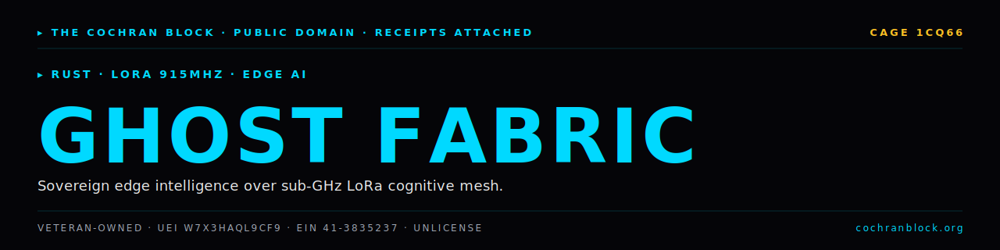

<!-- COCHRANBLOCK-BRAND-HEADER:START - generated by cochranblock/scripts/brand-stamp.sh -->
<picture>
  <source media="(prefers-color-scheme: dark)" srcset="assets/brand/banner.svg">
  <source media="(prefers-color-scheme: light)" srcset="assets/brand/banner.svg">
  
</picture>

[](https://unlicense.org)
[](https://www.rust-lang.org)
[](https://cochranblock.org)
[](https://cochranblock.org)

> &#9656; **RUST** &#183; **LORA 915MHZ** &#183; **EDGE AI**
<!-- COCHRANBLOCK-BRAND-HEADER:END -->


# Ghost Fabric

**Sovereign edge intelligence over sub-GHz cognitive mesh networks.**

Rust CLI + Android app for LoRa 915MHz mesh node management. Core subsystem traits (radio, mesh, inference, sensor) are defined with mock implementations for testing. Hardware drivers are planned.

---

## Documentation

This README is the entry point. The actual docs live in two source-of-truth files at the root of the repo:

- **[PROOF_OF_ARTIFACTS.md](PROOF_OF_ARTIFACTS.md)** — what exists today, status, source-linked. Build output, subsystem traits, CLI commands, platforms, packet authentication, QA results, federal compliance. If you want to know what this project *does*, read this.
- **[TIMELINE_OF_INVENTION.md](TIMELINE_OF_INVENTION.md)** — dated, commit-level record of what was built, when, and why. If you want to know how this project *got built*, read this.

Supporting docs:
- [BACKLOG.md](BACKLOG.md) — prioritized open work
- [WHITEPAPER.md](WHITEPAPER.md) — full technical argument and target architecture
- [ASSUMED_BREACH_THREAT_MODEL.md](ASSUMED_BREACH_THREAT_MODEL.md) — threat model
- [USER_STORY_ANALYSIS.md](USER_STORY_ANALYSIS.md) — user stories
- [govdocs/](govdocs/) — federal compliance (SBOM, SSDF, FIPS, CMMC, FedRAMP, ITAR/EAR, etc.)
- [docs/compression_map.md](docs/compression_map.md) — P13 tokenization (fN/tN/MN/cN)

---

## Run It

```bash
cargo build --release
ghost-fabric init      # generate node identity
ghost-fabric status    # show node config
ghost-fabric start     # start mesh node (Ctrl+C to stop)
```

Full build, run, and CLI examples in [PROOF_OF_ARTIFACTS.md](PROOF_OF_ARTIFACTS.md).

---

## License

Unlicense (public domain). See [UNLICENSE](UNLICENSE).

Built by [The Cochran Block](https://cochranblock.org).
<!-- COCHRANBLOCK-BRAND-FOOTER:START - generated by cochranblock/scripts/brand-stamp.sh -->

---

<sub>&#9656; **THE COCHRAN BLOCK, LLC** &#183; Veteran-Owned &#183; **CAGE** `1CQ66` &#183; **UEI** `W7X3HAQL9CF9` &#183; **EIN** `41-3835237`</sub>

<sub>&#9656; PUBLIC DOMAIN &#183; UNLICENSE &#183; RECEIPTS ATTACHED &#183; [**cochranblock.org**](https://cochranblock.org) &#183; [github.com/cochranblock](https://github.com/cochranblock)</sub>
<!-- COCHRANBLOCK-BRAND-FOOTER:END -->
